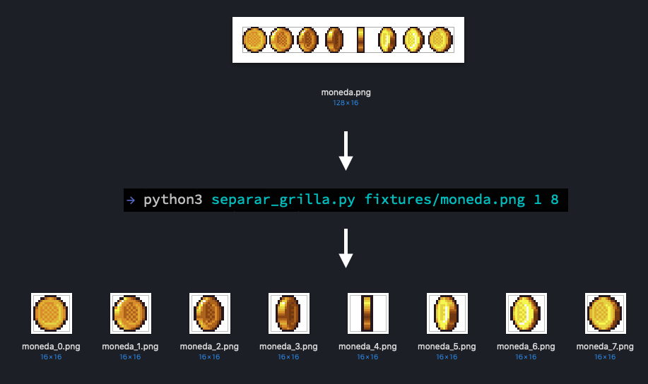

# Scripts

Pequeños programas para simplificar y automatizar alguna tareas personales.

## hoy.py

Genera un tag para ser utilizando dentro del editor bear, a modo de etiquetas.


## separar_grilla.py

Sirve para separar una imagen .png con varios cuadros de animación en pequeños archivos, uno por cada cuadro de la animación.

Primero tienes que indicar el nombre de archivo y luego las filas
y columnas que tiene la grilla:

```
python3 separar_grilla.py archivo.png filas columnas
```


